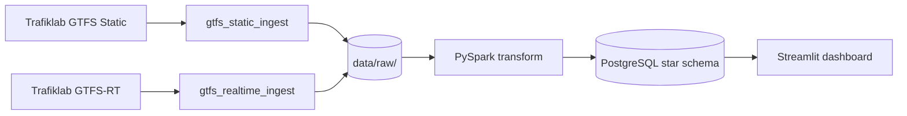

# Real-Time Delay Analytics Pipeline for Swedish Public Transport

An end-to-end data engineering pipeline: **Airflow** orchestration, **PySpark** transformation, **Kimball star schema** in PostgreSQL, and a **Streamlit** dashboard — built on Swedish GTFS data from Trafiklab.

## Why this project?

Public transit publishes **schedules** (GTFS static) and **live delays** (GTFS-RT), but they are rarely joined in a production-grade pipeline. This project:

- Ingests both feeds on a reliable schedule (Airflow)
- Transforms them into delay facts (PySpark)
- Models analytics in a star schema (PostgreSQL)
- Surfaces insights in a dashboard (Streamlit)

**Read the full rationale:** [docs/01-project-purpose-and-goals.md](docs/01-project-purpose-and-goals.md)

## Architecture



Details: [docs/02-architecture.md](docs/02-architecture.md)

## Project status

| Week | Focus | Status |
|---|---|---|
| 1 | Data access + Airflow ingestion | **Complete** |
| 2 | PySpark transform + star schema load | **In progress** |
| 3 | Streamlit dashboard + data quality + tests | Planned |
| 4 | CI/CD + docs + demo video | CI scaffolded |

**Week 1 checklist:** [docs/WEEK1_CHECKLIST.md](docs/WEEK1_CHECKLIST.md)  
**Operations runbook:** [docs/week1-runbook.md](docs/week1-runbook.md)

## Quick Start

### Prerequisites

- [Docker Desktop](https://www.docker.com/products/docker-desktop/)
- [Python 3.11+](https://www.python.org/downloads/)
- Free [Trafiklab API keys](https://developer.trafiklab.se) (static + realtime — separate keys)

### 1. Configure (VS Code terminal)

```powershell
cd E:\SUMMER_3RD_PROJECT
copy .env.example .env
```

Edit `.env`:

```env
TRAFIKLAB_STATIC_API_KEY=<GTFS Sweden 3 Static data key>
TRAFIKLAB_REALTIME_API_KEY=<GTFS Regional Realtime key>
STATIC_FEED=gtfs_sweden_3
REALTIME_FEED=gtfs_regional
OPERATOR=sl
```

### 2. Start Docker stack

```powershell
.\scripts\bootstrap.ps1
```

| Service | URL |
|---|---|
| Airflow UI | http://localhost:8081 (`admin` / `admin`) |
| Postgres DW | `localhost:5433` (`transit` / `transit`) |

### 3. Verify Week 1

```powershell
docker compose exec airflow-scheduler python /opt/airflow/project/scripts/test_api_key.py --operator sl
.\scripts\run_first_download.ps1
.\scripts\verify_week1.ps1
```

### 4. Trigger Airflow DAGs

At http://localhost:8081 trigger:

- `gtfs_static_ingest` — daily static GTFS
- `gtfs_realtime_ingest` — TripUpdates every 15 min

## Documentation

| Document | Purpose |
|---|---|
| [01-project-purpose-and-goals.md](docs/01-project-purpose-and-goals.md) | Why we're building this, goals, success criteria |
| [02-architecture.md](docs/02-architecture.md) | System design, data contracts, components |
| [week1-runbook.md](docs/week1-runbook.md) | Day-to-day ingest operations |
| [WEEK1_CHECKLIST.md](docs/WEEK1_CHECKLIST.md) | Week 1 completion gate |
| [transit_delay_pipeline_4week_plan.md](transit_delay_pipeline_4week_plan.md) | Full 4-week build plan |

## Project structure

```
├── dags/                  # Airflow DAGs
├── jobs/ingest/           # GTFS fetch + audit logging
├── config/                # Settings and URL builders
├── sql/                   # Star schema DDL
├── scripts/               # Bootstrap, verify, test API
├── docs/                  # Purpose, architecture, runbooks, ADRs
├── tests/                 # pytest suite
└── data/raw/              # Raw landing zone (gitignored)
```

## Development

```powershell
pip install -r requirements.txt
pytest
ruff check .
```

## Tech stack

Apache Airflow · PySpark · PostgreSQL · Streamlit · Docker · GitHub Actions · pytest

## License

MIT
