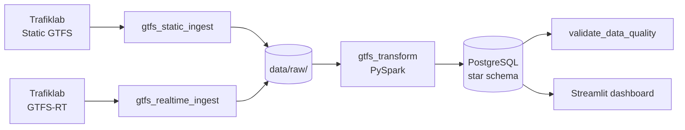

# Real-Time Delay Analytics Pipeline for Swedish Public Transport

A complete **data engineering** project that takes Swedish public transport data, cleans and joins it, stores it in a proper analytical database, and shows delay patterns in a simple dashboard.

Everything runs **locally in Docker** at **$0 cost**. No paid cloud is required.

---

## The problem (in simple words)

Swedish transit (for example **SL in Stockholm**) publishes two kinds of open data:

1. **The schedule** — when a bus, metro, or train is *planned* to arrive (GTFS static files).
2. **Live updates** — when it *actually* arrives, including how late or early it is (GTFS-RT TripUpdates).

These files exist separately. By themselves they do **not** easily answer questions like:

- Which routes are late most often?
- Which stops are the worst at rush hour?
- Do delays change by day of week or hour of day?

To answer those questions you need a **pipeline**: download the data on time, join schedule with live updates, store results in a clean model, check quality, and show charts. Without that, analysis stays messy — manual downloads and one-off scripts with no history.

---

## The goal of this project

Build an end-to-end pipeline that:

| Goal | What “done” looks like |
|---|---|
| **Ingest** | Airflow downloads static + realtime GTFS on a schedule into `data/raw/` |
| **Transform** | PySpark joins schedule + live updates and computes `delay_seconds` |
| **Model** | Results land in a Kimball **star schema** in PostgreSQL |
| **Quality** | Automated checks fail the pipeline when critical data is bad |
| **Serve** | A Streamlit dashboard shows delays by route, stop, and time |
| **Prove quality** | Tests + GitHub Actions CI keep the project trustworthy |

**Focus operator:** SL (Stockholm).  
**Data source:** [Trafiklab](https://www.trafiklab.se/) open GTFS APIs.

---

## How we planned the work (4-week plan)

We split the project into **four weeks**, each with a clear outcome. You do not start the next week until the current week’s **phase gate** is passed.

| Week | Theme | Main work | Phase gate (“do not continue until…”) |
|---|---|---|---|
| **1** | Foundation | Trafiklab access, Docker, Airflow, raw landing zone | Static + realtime files land on schedule |
| **2** | Transformation | Star schema DDL, PySpark job, load Postgres | `fact_trip_delay` has real rows; DAG run succeeds |
| **3** | Serving layer | Streamlit dashboard, data quality checks, pytest | Dashboard reads Postgres; DQ fails on bad data; tests green |
| **4** | Production polish | README, CI badge, demo video, optional public demo | CI green; docs + demo ready for portfolio |

Full plan document: [`transit_delay_pipeline_4week_plan.md`](transit_delay_pipeline_4week_plan.md)

### Why divide it this way?

- **Week 1** proves we can *get* the data reliably (harder than it sounds: API keys, feed types, folders).
- **Week 2** is the heaviest week: join logic, Spark, and the warehouse model.
- **Week 3** makes the data *useful and trustworthy* (dashboard + quality gates + tests).
- **Week 4** makes the project *readable for recruiters* (docs, CI, demo).

---

## How we progressed (what is done today)

| Week | Status | What we delivered |
|---|---|---|
| **1** | Complete | Airflow DAGs for static + realtime ingest; Docker Compose stack; landing zone under `data/raw/`; API key setup and runbooks |
| **2** | Complete | Star schema in Postgres; PySpark transform; `gtfs_transform` DAG; real delay facts loaded (e.g. 2026-07-12 and 2026-07-13); hard debugging documented (feed ID mismatch, DB name, upsert bugs, etc.) |
| **3** | Complete | Streamlit dashboard (KPIs, charts, map); data quality task after transform; 60+ pytest tests; CI with Postgres service |
| **4** | In progress | Public Streamlit Cloud deploy (sample data), CI badge, demo video, portfolio polish |

Checklists:

- [Week 1](docs/WEEK1_CHECKLIST.md) · [Week 2](docs/WEEK2_CHECKLIST.md) · [Week 3](docs/WEEK3_CHECKLIST.md)

---

## Overall architecture (simple picture)

Think of the system as a **factory line**:

```
Trafiklab (internet)
        │
        ▼
   Airflow DAGs          ← “the schedule / supervisor”
   (download jobs)
        │
        ▼
   data/raw/             ← “raw warehouse shelves” (immutable files)
        │
        ▼
   PySpark transform     ← “the workshop” (join + delay math)
        │
        ▼
   PostgreSQL            ← “the curated store” (star schema)
        │
        ├──► Data quality checks  ← “quality control”
        │
        └──► Streamlit dashboard  ← “the shop window”
```



### What each piece does

| Piece | Role in plain language |
|---|---|
| **Trafiklab** | Source of schedules and live delay updates |
| **Airflow** | Runs jobs on time, retries on failure, shows status in a UI |
| **`data/raw/`** | Saves original downloads by date (we do not overwrite history) |
| **PySpark** | Reads big GTFS files, joins schedule ↔ live updates, computes delays |
| **PostgreSQL** | Stores clean tables for analysis (`dim_*` + `fact_trip_delay`) |
| **Data quality** | Stops the pipeline if critical checks fail |
| **Streamlit** | Interactive charts for routes, stops, hours, and map |

More detail: [`docs/02-architecture.md`](docs/02-architecture.md)

### Star schema (how data is organized)

We use a classic **Kimball star**:

- **Dimensions** = “who / what / where / when” (route, stop, date, vehicle type)
- **Fact** = “the measurement” — one delay observation

**Fact grain:** one row in `fact_trip_delay` ≈ one trip + one stop + one service date + stop sequence.

```
        dim_date
           │
dim_route ─┼─ fact_trip_delay ─┬─ dim_stop
           │                   │
   dim_vehicle_type ───────────┘
```

DDL: [`sql/schema.sql`](sql/schema.sql)

---

## Project structure (folders)

```
├── dags/                     # Airflow DAG definitions (schedules + tasks)
│   ├── dag_ingest_gtfs.py    # Daily static download
│   ├── dag_realtime_gtfs.py  # Realtime snapshots every 15 min
│   └── dag_gtfs_transform.py # Transform + data quality
│
├── jobs/
│   ├── ingest/               # Download scripts for Trafiklab
│   ├── transform/            # Helpers: time parsing, loaders, paths
│   ├── transform_gtfs.py     # Main PySpark transform job
│   └── validate_data_quality.py
│
├── dashboard/
│   ├── app.py                # Streamlit UI
│   └── queries.py            # Safe SQL for charts
│
├── sql/                      # Schema, seeds, indexes
├── config/                   # Settings from .env
├── scripts/                  # Bootstrap / verify helpers
├── tests/                    # Unit + integration tests
├── docs/                     # Goals, architecture, week checklists, ADRs
├── data/raw/                 # Downloaded GTFS (gitignored)
├── docker/                   # Airflow image
├── docker-compose.yml        # Local stack
└── transit_delay_pipeline_4week_plan.md
```

---

## Tech stack

| Layer | Tool | Why |
|---|---|---|
| Orchestration | Apache Airflow | Schedules, retries, visible DAG runs |
| Processing | PySpark | Handles large GTFS volumes |
| Warehouse | PostgreSQL | Reliable SQL store for analytics |
| Dashboard | Streamlit | Fast Python UI for charts/maps |
| Containers | Docker Compose | Same stack on any machine |
| Quality | Custom DQ checks + pytest | Fail fast + regression safety |
| CI | GitHub Actions | Lint + tests on every push |

---

## Quick start (run it locally)

### Prerequisites

- [Docker Desktop](https://www.docker.com/products/docker-desktop/)
- Python 3.11+
- Free Trafiklab keys from [developer.trafiklab.se](https://developer.trafiklab.se)

**Important:** Static and realtime feeds must be from the **same ID family**, or joins return 0 rows.  
Recommended pairing:

- Static: `STATIC_FEED=gtfs_sweden_3`
- Realtime: `REALTIME_FEED=gtfs_sweden`  
  (needs the “GTFS Sweden 3 Realtime” product key)

See [`docs/decisions/003-ingest-feed-types.md`](docs/decisions/003-ingest-feed-types.md).

### 1. Configure

```powershell
cd E:\SUMMER_3RD_PROJECT
copy .env.example .env
```

Edit `.env` and set your keys (example):

```env
TRAFIKLAB_STATIC_API_KEY=<your static key>
TRAFIKLAB_REALTIME_API_KEY=<your sweden realtime key>
STATIC_FEED=gtfs_sweden_3
REALTIME_FEED=gtfs_sweden
OPERATOR=sl
POSTGRES_HOST=localhost
POSTGRES_PORT=5433
```

### 2. Start the stack

```powershell
.\scripts\bootstrap.ps1
```

| Service | Where |
|---|---|
| Airflow UI | http://localhost:8081 (`admin` / `admin`) |
| Analytics Postgres | `localhost:5433` (`transit` / `transit`, DB `transit_dw`) |
| Streamlit (after Week 3) | http://localhost:8501 |

### 3. Run the pipeline (high level)

1. Trigger **`gtfs_static_ingest`** and **`gtfs_realtime_ingest`** in Airflow (or let the schedule run).
2. Trigger **`gtfs_transform`** for a date that has both static + realtime files.
3. Open the dashboard:

```powershell
py -m pip install -r requirements.txt
py -m streamlit run dashboard/app.py
```

Then open **http://localhost:8501** in your browser.

> **Local:** needs Docker Postgres running.  
> **Public website:** deploy on Streamlit Community Cloud with a sample CSV — see
> [docs/public-dashboard-deploy.md](docs/public-dashboard-deploy.md).

## Public websites (two parts)

| Site | What it is | Host |
|---|---|---|
| **Landing page** | Project story, architecture, 4-week plan, screenshot gallery, links | **GitHub Pages** (static HTML) |
| **Interactive dashboard** | Filters → KPIs, charts, map, stops | **Streamlit Cloud** (runs Python) |

### 1) GitHub Pages landing page

Source file: [`docs/index.html`](docs/index.html)

Enable it: repo **Settings → Pages → Deploy from branch `main` / folder `/docs`**.  
Guide: [docs/github-pages.md](docs/github-pages.md)

Expected URL:

`https://gvarun20.github.io/Real_Time_Delay_Analytics_Swedish_Public_Transport/`

### 2) Live Streamlit dashboard

Uses a **sample CSV** in the repo (no API keys, no home Postgres online).

1. Sample data is already in `dashboard/sample_data/delay_facts.csv.gz` (replace later with `py scripts/export_dashboard_sample.py` when Docker Postgres is up)
2. Deploy at [share.streamlit.io](https://share.streamlit.io):
   - Main file: `dashboard/app.py`
   - Requirements: `dashboard/requirements.txt`
3. Paste the Streamlit URL into `window.LIVE_DASHBOARD_URL` in `docs/index.html`

Full guide: [docs/public-dashboard-deploy.md](docs/public-dashboard-deploy.md)

**Landing page:** _enable GitHub Pages, then add the URL here_  
**Live dashboard:** _add your Streamlit app link here after deploy_

---

## How to read the dashboard (what each part means)

The Streamlit app is the “shop window” of the pipeline. You choose filters on the left, then the page shows delay results.

### Step 1 — Use the sidebar filters

| Filter | What it does |
|---|---|
| **Date range** | Which service days to include (only dates that already have data in Postgres) |
| **Route** | Focus on one or more bus/metro/rail lines (leave empty = all routes) |
| **Vehicle type** | Bus, Metro, Rail, etc. (leave empty = all types) |

Change a filter → the KPIs and charts update for that selection.

### Step 2 — Read the KPI cards (top of the page)

KPIs are the **quick health check** of the network for your selected period. Look here first before diving into charts.

| KPI | Meaning | Why it matters |
|---|---|---|
| **Median delay** | The “middle” delay (half of trips are better, half worse) | More stable than average — one crazy late trip does not dominate |
| **% on-time (≤0 delay)** | Share of observations that arrived on time or early | Simple service-quality score |
| **Trips observed** | How many distinct trips we saw in the data | Shows if you have enough data to trust the charts |
| **Worst route (avg delay)** | Route with the highest average delay in the filter | Points you to where to investigate next |

**Positive delay** = late. **Negative delay** = early. **0** = on time.

### Step 3 — Average delay by route (bar chart)

- Horizontal bars: each bar is a route.
- Longer / redder usually means **more late on average**.
- Use this to answer: *“Which lines are struggling?”*

### Step 4 — Delay heatmap (hour × day of week)

- Rows = day of week, columns = hour of day.
- Darker / warmer cells = worse average delay in that time slot.
- Use this to answer: *“Is rush hour worse? Are weekends different?”*

### Step 5 — Map of stops (colored by delay)

- Each point is a **stop** (with latitude / longitude).
- Color = average delay at that stop (for your filters).
- Size = how many observations we have (bigger = more data).
- Hover a point to see the stop name and delay.

**Why the map matters:** tables show *names*; the map shows *where* problems cluster (for example a corridor or station area).

### Step 6 — Top 10 worst stops (table)

- Sorted list of stops with the highest average delay.
- Includes observation count so tiny sample sizes do not mislead you.
- Use this with the map: table for ranking, map for location.

### Step 7 — Delay distribution (histogram)

- Shows how delays are spread (many small delays vs a few huge ones).
- The vertical line at **0** separates early (left) from late (right).
- Use this to answer: *“Are most trips a little late, or are we pulled by outliers?”*

### If the page says “No data”

- The filters are too narrow, **or**
- That date was never transformed into Postgres yet.

Widen the date range, clear route filters, or run `gtfs_transform` for more days.

---

### 4. Run tests

```powershell
py -m ruff check .
py -m pytest -q
```

---

## What we learned along the way (honest progress notes)

Building this was not only “happy path” coding. Real issues we hit and fixed include:

1. **Feed family mismatch** — Sweden static IDs do not match regional realtime IDs → join returned 0 rows.  
2. **Wrong database name** in Docker env (`transit` vs `transit_dw`).  
3. **Silent key-map bug** with `psycopg2.execute_values` (needed `fetch=True`).  
4. **Duplicate realtime keys** on full (non-sampled) loads → Postgres `CardinalityViolation`.  
5. **Missing Airflow `fs_default` connection** for `FileSensor`.

These are documented in [`docs/decisions/004-week2-transform-debugging.md`](docs/decisions/004-week2-transform-debugging.md) — useful for interviews (“how do you debug production-style pipelines?”).

---

## Documentation map

| Document | What it explains |
|---|---|
| [docs/01-project-purpose-and-goals.md](docs/01-project-purpose-and-goals.md) | Purpose, goals, success criteria |
| [docs/02-architecture.md](docs/02-architecture.md) | Components and data contracts |
| [transit_delay_pipeline_4week_plan.md](transit_delay_pipeline_4week_plan.md) | Full 4-week plan |
| [docs/WEEK1_CHECKLIST.md](docs/WEEK1_CHECKLIST.md) · [WEEK2](docs/WEEK2_CHECKLIST.md) · [WEEK3](docs/WEEK3_CHECKLIST.md) | Week completion gates |
| [docs/week1-runbook.md](docs/week1-runbook.md) · [week2](docs/week2-runbook.md) · [week3](docs/week3-runbook.md) | How to operate each week |
| [docs/decisions/](docs/decisions/) | Architecture Decision Records (ADRs) |

---

## Project status (summary)

| Area | Status |
|---|---|
| Ingestion (Airflow) | Working |
| Transform (PySpark → Postgres) | Working |
| Data quality gate | Working |
| Dashboard (local Streamlit) | Working |
| Automated tests + CI | Working |
| Public hosted demo / video | Week 4 |

---

## License

MIT
