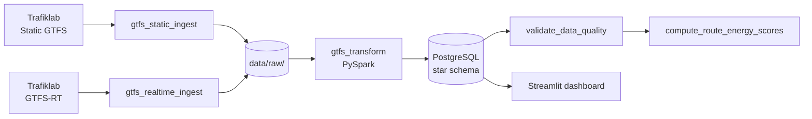

# Real-Time Delay Analytics for Swedish Public Transport

[](https://github.com/gvarun20/Real_Time_Delay_Analytics_Swedish_Public_Transport/actions/workflows/ci.yml)

**End-to-end data engineering portfolio project:** ingest Swedish transit schedules + live delays, join them with PySpark, store results in a Kimball star schema (PostgreSQL), gate quality with automated checks, and serve insights in Streamlit — orchestrated by Airflow, tested in GitHub Actions, runnable locally at **$0 cost**.

---

## Quick links

| What | Link |
|---|---|
| **This repository** | https://github.com/gvarun20/Real_Time_Delay_Analytics_Swedish_Public_Transport |
| **Live dashboard** (Streamlit Cloud — sample data) | https://realtime--delay--analytics--swedish--publictransport.streamlit.app/ |
| **Project landing page** (GitHub Pages) | https://gvarun20.github.io/Real_Time_Delay_Analytics_Swedish_Public_Transport/ |
| **CI status** (GitHub Actions) | https://github.com/gvarun20/Real_Time_Delay_Analytics_Swedish_Public_Transport/actions |
| **Docs hub** (start reading here) | [`docs/00-START_HERE.md`](docs/00-START_HERE.md) |
| **4-week build plan** | [`transit_delay_pipeline_4week_plan.md`](transit_delay_pipeline_4week_plan.md) |

> **Note:** The public dashboard may show “waking up” on first open (Streamlit free tier sleeps when idle). Wait 30–90 seconds, then refresh. Local dashboard is always available when Docker Postgres is running.

---

## How to read this project (recommended path)

Use this order if you are a **recruiter, interviewer, or developer new to the repo**:

| Step | Time | Open this | You will understand |
|---:|---|---|---|
| 1 | 2 min | This README (sections below) | Need → goals → architecture → live demos |
| 2 | 10 min | [docs/05-how-to-understand-this-project.md](docs/05-how-to-understand-this-project.md) | **Simplest full story** (start here if new) |
| 3 | 5 min | [docs/01-project-purpose-and-goals.md](docs/01-project-purpose-and-goals.md) | Why it exists, success criteria, personas |
| 4 | 10 min | [docs/03-star-schema-explained.md](docs/03-star-schema-explained.md) | Facts, dimensions, grain (Kimball) |
| 5 | 10 min | [docs/02-architecture.md](docs/02-architecture.md) | How data moves through the system |
| 6 | 5 min | [docs/04-glossary.md](docs/04-glossary.md) | GTFS, DAG, ETL, CI, … |
| 7 | 10 min | [transit_delay_pipeline_4week_plan.md](transit_delay_pipeline_4week_plan.md) | How the project was planned week by week |
| 8 | Optional | [docs/decisions/](docs/decisions/) | Real design choices and bugs we fixed |

**One-sentence summary:**  
We download SL (Stockholm) schedules and live delays from Trafiklab, join them with PySpark, store delay facts in PostgreSQL, check quality, and show charts (plus relative bus energy scores) in Streamlit.

---

## Why this project is needed

Swedish operators (here: **SL Stockholm**) publish open data in two separate worlds:

1. **GTFS static** — the *planned* timetable (when a bus *should* arrive).
2. **GTFS-RT TripUpdates** — *live* updates (when it *actually* arrives / how late it is).

Those files do **not** answer business questions by themselves:

- Which routes are late most often?
- Which stops are worst at rush hour?
- Do delays change by weekday or hour?
- Which bus routes look like a heavier relative “workload” (distance + duration + stops + delay)?

To answer that you need a **pipeline**, not a spreadsheet:

| Without a pipeline | With this project |
|---|---|
| Manual downloads, one-off scripts | Scheduled Airflow ingest into `data/raw/` |
| No join history / audit trail | Dated landing zone + `pipeline_runs` |
| Ad-hoc CSV analysis | Kimball star schema in PostgreSQL |
| “Trust me” numbers | Data-quality gates + pytest + CI |
| Nothing to show stakeholders | Streamlit dashboard + public demo links |

**Who it is for**

| Persona | What they get |
|---|---|
| **Data analyst** | Delay trends by route, stop, hour, day |
| **Operator / planner (hypothetical)** | Chronic late stops and high relative-energy bus routes |
| **Hiring manager / interviewer** | Proof of Airflow, PySpark, dimensional modeling, DQ, Docker, CI/CD |
| **You (learner)** | A repeatable 4-week build with runbooks and ADRs |

Full purpose write-up: [docs/01-project-purpose-and-goals.md](docs/01-project-purpose-and-goals.md)

---

## What we are building (goals)

| Goal | What “done” looks like |
|---|---|
| **Ingest** | Airflow downloads static + realtime GTFS on a schedule into `data/raw/` |
| **Transform** | PySpark joins schedule ↔ live updates and computes `delay_seconds` |
| **Model** | Kimball **star schema** in PostgreSQL (`dim_*` + `fact_trip_delay` + `fact_route_energy_score`) |
| **Quality** | Automated DQ checks can fail the DAG when critical data is bad |
| **Serve** | Streamlit: delays (KPIs, heatmap, map) + **Energy scores** tab |
| **Prove** | pytest + GitHub Actions CI on every push/PR to `main` |
| **Share** | Public landing page + Streamlit Cloud sample dashboard |

**Operator:** SL (Stockholm) · **Source:** [Trafiklab](https://www.trafiklab.se/) · **Cost:** $0 local Docker

---

## How we built it (4-week plan)

We did **not** build everything at once. Each week has a **phase gate** — do not start the next week until the gate passes.

| Week | Theme | Main work | Phase gate |
|---|---|---|---|
| **1** | Foundation | Trafiklab keys, Docker, Airflow, raw landing zone | Static + realtime files land on schedule |
| **2** | Transformation | Star schema DDL, PySpark job, load Postgres | `fact_trip_delay` has real rows; DAG succeeds |
| **3** | Serving | Streamlit, data quality, pytest, CI | Dashboard reads Postgres; DQ + tests green |
| **4** | Polish | Public demos, README, CI badge, energy scores, docs | Links live; CI green; portfolio-ready |

Full plan: [`transit_delay_pipeline_4week_plan.md`](transit_delay_pipeline_4week_plan.md)

### Why this order?

- **Week 1** proves we can *get* data reliably (API keys, feed families, folders).
- **Week 2** is the hardest week: joins, Spark, warehouse model, real debugging.
- **Week 3** makes data *useful and trustworthy* (UI + quality + tests).
- **Week 4** makes the project *readable for outsiders* (demos, docs, extra analytics).

### Progress today

| Week | Status | Delivered |
|---|---|---|
| **1** | ✅ Complete | `gtfs_static_ingest`, `gtfs_realtime_ingest`, Docker Compose, `data/raw/`, runbooks |
| **2** | ✅ Complete | Star schema, PySpark transform, `gtfs_transform` DAG, real delay facts loaded |
| **3** | ✅ Complete | Streamlit delays UI, DQ task, 70+ pytest tests, GitHub Actions CI |
| **4** | ✅ Mostly complete | Public Streamlit + GitHub Pages, CI refresh, relative **bus energy scores**, beginner docs |

Checklists: [Week 1](docs/WEEK1_CHECKLIST.md) · [Week 2](docs/WEEK2_CHECKLIST.md) · [Week 3](docs/WEEK3_CHECKLIST.md) · [Week 4](docs/WEEK4_CHECKLIST.md)

---

## Architecture (how data flows)

```
Trafiklab (internet)
        │
        ▼
   Airflow DAGs                 ← schedule / retries / UI
   (static + realtime ingest)
        │
        ▼
   data/raw/{date}/             ← immutable landing zone
        │
        ▼
   PySpark transform            ← join schedule ↔ TripUpdates → delay_seconds
        │
        ▼
   PostgreSQL (star schema)     ← dims + fact_trip_delay + energy scores
        │
        ├──► validate_data_quality
        ├──► compute_route_energy_scores
        └──► Streamlit dashboard
```


```mermaid
flowchart LR
    A[Trafiklab<br/>Static GTFS] --> B[gtfs_static_ingest]
    C[Trafiklab<br/>GTFS-RT] --> D[gtfs_realtime_ingest]
    B --> E[(data/raw/)]
    D --> E
    E --> F[gtfs_transform<br/>PySpark]
    F --> G[(PostgreSQL<br/>star schema)]
    G --> H[validate_data_quality]
    H --> J[compute_route_energy_scores]
    G --> I[Streamlit dashboard]
```

| Piece | Role |
|---|---|
| **Trafiklab** | Source of schedules and live updates |
| **Airflow** | Runs jobs on time, retries, shows DAG status |
| **`data/raw/`** | Keeps original downloads by date |
| **PySpark** | Large GTFS join + delay calculation |
| **PostgreSQL** | Analytical warehouse |
| **DQ checks** | Fail the pipeline on critical errors |
| **Energy scores** | Relative 0–100 bus workload index (not measured kWh) |
| **Streamlit** | Interactive charts for humans |

Deep dive: [docs/02-architecture.md](docs/02-architecture.md)

### Star schema (warehouse model)

- **Dimensions** = context (route, stop, date, vehicle type)
- **Facts** = measurements  
  - `fact_trip_delay` — one row ≈ trip × stop × service date × stop sequence  
  - `fact_route_energy_score` — relative bus energy score per route × date × region

```
        dim_date
           │
dim_route ─┼─ fact_trip_delay ─┬─ dim_stop
           │                   │
   dim_vehicle_type ───────────┘
           │
           └── fact_route_energy_score
```

Beginner explanation: [docs/03-star-schema-explained.md](docs/03-star-schema-explained.md) · DDL: [`sql/schema.sql`](sql/schema.sql)

---

## Live demos (what to click)

| Site | What you see | Host |
|---|---|---|
| [**Landing page**](https://gvarun20.github.io/Real_Time_Delay_Analytics_Swedish_Public_Transport/) | Problem, goals, architecture story, links | GitHub Pages (`/docs`) |
| [**Live dashboard**](https://realtime--delay--analytics--swedish--publictransport.streamlit.app/) | Filters → KPIs, charts, map; Energy scores tab needs local Postgres | Streamlit Cloud (sample CSV for delays) |

Setup guides: [docs/github-pages.md](docs/github-pages.md) · [docs/public-dashboard-deploy.md](docs/public-dashboard-deploy.md)

---

## How to use the dashboard

Two tabs after the pipeline has data:

### Tab: Delays

| Section | What it answers |
|---|---|
| **KPI cards** | Overall health: median delay, % on-time, trips observed, worst route |
| **Avg delay by route** | Which lines are late on average? |
| **Heatmap** | Is rush hour / weekend worse? |
| **Map + worst stops** | *Where* do problems cluster? |
| **Punctuality view** | % early / on time / late + % within 1–10 minutes |

**Sign convention:** `delay_seconds > 0` late · `= 0` on time · `< 0` early · `NULL` = no realtime match.

### Tab: Energy scores

Relative **0–100 workload index** for buses (distance + duration + stops + delay). **Not kWh / fuel.**  
Flagged routes get reason tags (`LONG_DISTANCE`, `CONGESTION`, …).  
Runbook: [docs/energy-score-runbook.md](docs/energy-score-runbook.md)

---

## Project structure

```
├── dags/                          # Airflow DAGs
│   ├── dag_ingest_gtfs.py         # Daily static download
│   ├── dag_realtime_gtfs.py       # Realtime snapshots (~15 min)
│   └── dag_gtfs_transform.py      # Transform → DQ → energy scores
├── jobs/
│   ├── ingest/                    # Trafiklab downloaders
│   ├── transform/                 # Loaders, time utils, paths
│   ├── energy/                    # Relative energy scoring helpers
│   ├── transform_gtfs.py          # Main PySpark job
│   ├── compute_route_energy_scores.py
│   └── validate_data_quality.py
├── dashboard/
│   ├── app.py                     # Streamlit UI (Delays + Energy)
│   ├── queries.py / energy_queries.py
│   └── sample_data/               # Public demo CSV
├── sql/                           # schema, seeds, indexes, energy DDL
├── config/                        # Settings from .env
├── tests/                         # Unit + integration
├── docs/                          # Beginner docs, runbooks, ADRs, Pages site
├── .github/workflows/ci.yml       # Lint + Postgres pytest
├── docker-compose.yml
└── transit_delay_pipeline_4week_plan.md
```

---

## Tech stack

| Layer | Tool | Why |
|---|---|---|
| Orchestration | Apache Airflow | Schedules, retries, visible runs |
| Processing | PySpark | Large GTFS volumes |
| Warehouse | PostgreSQL | SQL analytics store |
| Dashboard | Streamlit + Plotly | Fast interactive UI |
| Containers | Docker Compose | Reproducible $0 local stack |
| Quality | Custom DQ + pytest | Fail fast + regressions |
| CI | GitHub Actions | Lint + tests on every push/PR |
| CD (docs) | GitHub Pages | Landing page from `/docs` |
| CD (demo) | Streamlit Cloud | Public sample dashboard |

---

## Quick start (run locally)

### Prerequisites

- [Docker Desktop](https://www.docker.com/products/docker-desktop/)
- Python 3.11+
- Free keys from [developer.trafiklab.se](https://developer.trafiklab.se)

**Critical:** static and realtime feeds must share the **same ID family**, or joins return 0 rows.

| Setting | Recommended value |
|---|---|
| `STATIC_FEED` | `gtfs_sweden_3` |
| `REALTIME_FEED` | `gtfs_sweden` |

See [docs/decisions/003-ingest-feed-types.md](docs/decisions/003-ingest-feed-types.md).

### 1. Configure

```powershell
cd E:\SUMMER_3RD_PROJECT   # or your clone path
copy .env.example .env
```

Set in `.env`:

```env
TRAFIKLAB_STATIC_API_KEY=<your static key>
TRAFIKLAB_REALTIME_API_KEY=<your sweden realtime key>
STATIC_FEED=gtfs_sweden_3
REALTIME_FEED=gtfs_sweden
OPERATOR=sl
POSTGRES_HOST=localhost
POSTGRES_PORT=5433
```

### 2. Start the stack

```powershell
.\scripts\bootstrap.ps1
```

| Service | URL / connection |
|---|---|
| Airflow UI | http://localhost:8081 (`admin` / `admin`) |
| Analytics Postgres | `localhost:5433` · user/db `transit` / `transit_dw` |
| Streamlit (local) | http://localhost:8501 |

### 3. Run the pipeline

1. Trigger **`gtfs_static_ingest`** and **`gtfs_realtime_ingest`** in Airflow.
2. Trigger **`gtfs_transform`** for a date that has both feeds (loads facts, runs DQ, computes energy scores).
3. Open the dashboard:

```powershell
py -m pip install -r requirements.txt
py -m streamlit run dashboard/app.py
```

Operate week-by-week: [week1-runbook](docs/week1-runbook.md) · [week2](docs/week2-runbook.md) · [week3](docs/week3-runbook.md) · [energy scores](docs/energy-score-runbook.md)

### 4. Tests (same idea as CI)

```powershell
py -m ruff check .
py -m pytest -q
```

---

## CI / CD

| Automation | What it does | Link |
|---|---|---|
| **CI** | On push/PR to `main` (+ manual run): pip cache, `ruff`, load SQL into Postgres 15, pytest + coverage | [Actions → CI](https://github.com/gvarun20/Real_Time_Delay_Analytics_Swedish_Public_Transport/actions/workflows/ci.yml) |
| **CD — docs** | GitHub Pages publishes `/docs` | [Landing page](https://gvarun20.github.io/Real_Time_Delay_Analytics_Swedish_Public_Transport/) |
| **CD — dashboard** | Streamlit Cloud redeploys from `main` | [Live dashboard](https://realtime--delay--analytics--swedish--publictransport.streamlit.app/) |

Workflow file: [`.github/workflows/ci.yml`](.github/workflows/ci.yml)

---

## What we learned (real debugging)

Building this was not only happy-path coding. Issues we hit and fixed:

1. **Feed family mismatch** — static IDs ≠ realtime IDs → 0 join rows  
2. **Wrong Postgres DB name** in Docker (`transit` vs `transit_dw`)  
3. **`execute_values` key-map bug** (needed `fetch=True`)  
4. **Duplicate realtime keys** on full loads → `CardinalityViolation`  
5. **Missing Airflow `fs_default` connection** for `FileSensor`

Write-up: [docs/decisions/004-week2-transform-debugging.md](docs/decisions/004-week2-transform-debugging.md)

Other ADRs: [001 operator](docs/decisions/001-operator-choice.md) · [002 dual API keys](docs/decisions/002-dual-api-keys.md) · [003 feed types](docs/decisions/003-ingest-feed-types.md)

---

## Documentation map

| Document | Purpose |
|---|---|
| [docs/00-START_HERE.md](docs/00-START_HERE.md) | **Beginner reading order** |
| [docs/05-how-to-understand-this-project.md](docs/05-how-to-understand-this-project.md) | 10-minute plain-language overview |
| [docs/01-project-purpose-and-goals.md](docs/01-project-purpose-and-goals.md) | Need, goals, personas |
| [docs/02-architecture.md](docs/02-architecture.md) | Components & data flow |
| [docs/03-star-schema-explained.md](docs/03-star-schema-explained.md) | Kimball model in plain English |
| [docs/04-glossary.md](docs/04-glossary.md) | Terms (GTFS, DAG, grain, …) |
| [transit_delay_pipeline_4week_plan.md](transit_delay_pipeline_4week_plan.md) | Full build plan |
| [docs/WEEK1_CHECKLIST.md](docs/WEEK1_CHECKLIST.md) · [WEEK2](docs/WEEK2_CHECKLIST.md) · [WEEK3](docs/WEEK3_CHECKLIST.md) | Phase gates |
| [docs/week1-runbook.md](docs/week1-runbook.md) · [week2](docs/week2-runbook.md) · [week3](docs/week3-runbook.md) | Operator commands |
| [docs/energy-score-runbook.md](docs/energy-score-runbook.md) | Relative energy scores |
| [docs/public-dashboard-deploy.md](docs/public-dashboard-deploy.md) | Streamlit Cloud |
| [docs/github-pages.md](docs/github-pages.md) | Landing page |
| [docs/decisions/](docs/decisions/) | Architecture Decision Records |

---

## Project status

| Area | Status |
|---|---|
| Ingestion (Airflow) | Working |
| Transform (PySpark → Postgres) | Working |
| Data quality gate | Working |
| Delay dashboard (local + public sample) | Working |
| Relative bus energy scores | Working (local Postgres + public sample CSV) |
| Tests + CI | Working |
| GitHub Pages landing | Live |
| Streamlit Cloud demo | Live (may sleep when idle) |

---

## License

MIT
