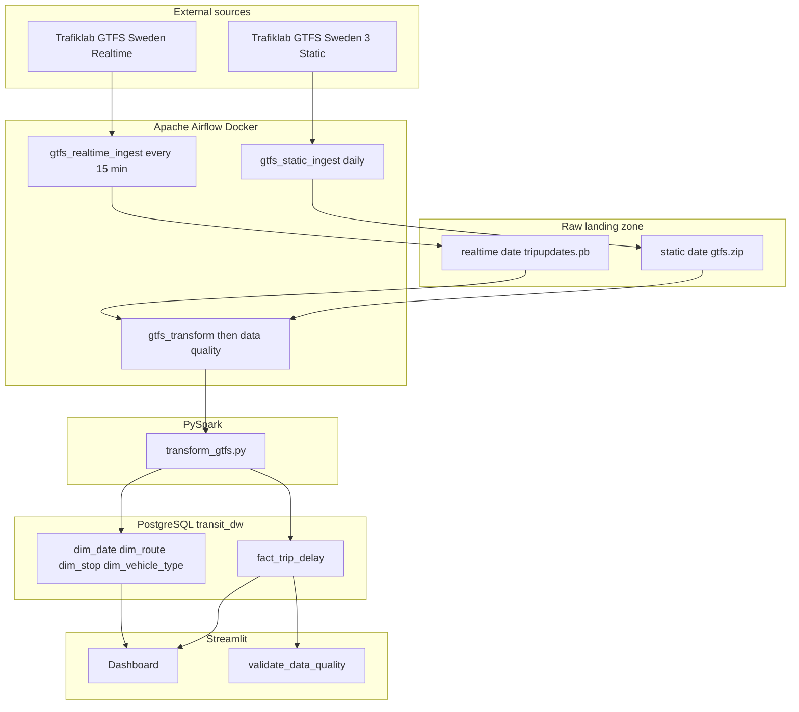

# System Architecture

## High-level overview



**In plain words:** Trafiklab → Airflow downloads → files in `data/raw/` → PySpark join + delay math → PostgreSQL star schema → data quality check → Streamlit charts.

## Component map

| Component | Role | Port (local) |
|---|---|---|
| `gtfs_static_ingest` | Daily pull of Sweden GTFS zip | — |
| `gtfs_realtime_ingest` | 15-min TripUpdates snapshots for SL | — |
| `gtfs_transform` | PySpark load + `validate_data_quality` | — |
| Airflow webserver | UI + DAG management | **8081** |
| Postgres `transit_dw` | Star schema warehouse | **5433** |
| Postgres `airflow` | Airflow metadata (internal) | internal |
| Raw landing zone | Immutable ingest snapshots | `data/raw/` |
| Streamlit dashboard | Read-only analytics UI | **8501** (local) / Streamlit Cloud (public) |

## Data contracts

### Static landing

```text
data/raw/static/{YYYY-MM-DD}/gtfs.zip
data/raw/static/{YYYY-MM-DD}/metadata.json
```

### Realtime landing

```text
data/raw/realtime/{YYYY-MM-DD}/{HH-mm-ss}/tripupdates.pb
data/raw/realtime/{YYYY-MM-DD}/{HH-mm-ss}/metadata.json
```

### API key mapping (Trafiklab)

| Product | Env variable | Endpoint pattern |
|---|---|---|
| GTFS Sweden 3 Static | `TRAFIKLAB_STATIC_API_KEY` | `/gtfs-sweden/sweden.zip` |
| GTFS Sweden Realtime | `TRAFIKLAB_REALTIME_API_KEY` | `/gtfs-rt-sweden/{operator}/TripUpdatesSweden.pb` |

**Important:** static and realtime must be the same ID family, or joins return 0 rows.  
See [decisions/003-ingest-feed-types.md](decisions/003-ingest-feed-types.md) and [decisions/002-dual-api-keys.md](decisions/002-dual-api-keys.md).

## Star schema

**New to this idea?** Read the beginner guide first:  
[03-star-schema-explained.md](03-star-schema-explained.md) — what facts/dimensions are, why Kimball, why we use it here.

**Fact grain:** one row per `(trip_id, stop_key, date_key, stop_sequence)`

| Table | Purpose |
|---|---|
| `dim_date` | Calendar attributes (weekend, day name) |
| `dim_route` | Route metadata + operator |
| `dim_stop` | Stop name, lat/lon |
| `dim_vehicle_type` | Bus, metro, rail, etc. |
| `fact_trip_delay` | Scheduled vs actual arrival, `delay_seconds` |
| `pipeline_runs` | Run status + `dq_status` |

DDL: [../sql/schema.sql](../sql/schema.sql)

## Why separate ingest DAGs

| Feed | How often it changes | Our schedule |
|---|---|---|
| Static GTFS | Daily (large zip) | `@daily` via `gtfs_static_ingest` |
| Realtime TripUpdates | Continuously | every 15 minutes via `gtfs_realtime_ingest` |

Transform runs as its own DAG (`gtfs_transform`) after raw files exist for that service date:

1. Wait for static zip (`FileSensor`)
2. Check realtime snapshot exists
3. Run PySpark transform
4. Run data quality checks

## Failure handling

- **Retries:** 3 attempts, 5-minute delay (`dags/common.py`)
- **on_failure_callback:** writes to `logs/failures/`
- **Ingest audit:** append-only `logs/ingest_runs.jsonl`
- **Data quality:** ERROR checks fail the transform DAG; WARN checks log only

## Repository layout

```text
dags/                 Airflow DAG definitions
jobs/ingest/          Download + land GTFS files
jobs/transform/       Helpers (time, loaders, paths, RT parse)
jobs/transform_gtfs.py
jobs/validate_data_quality.py
dashboard/            Streamlit app + sample data for public demo
config/               Settings, URL builders
sql/                  Star schema DDL
scripts/              Bootstrap, verify, export sample
docs/                 Purpose, architecture, runbooks, ADRs
tests/                Unit + integration tests
data/raw/             Raw landing zone (gitignored)
```

## Public vs local serving

| Mode | Where | Data source |
|---|---|---|
| Local | `streamlit run dashboard/app.py` | Live Postgres `transit_dw` |
| Public | Streamlit Community Cloud | Sample CSV in `dashboard/sample_data/` |
| Project site | GitHub Pages (`docs/index.html`) | Static landing page + links |

Debugging history for transform failures: [decisions/004-week2-transform-debugging.md](decisions/004-week2-transform-debugging.md).
